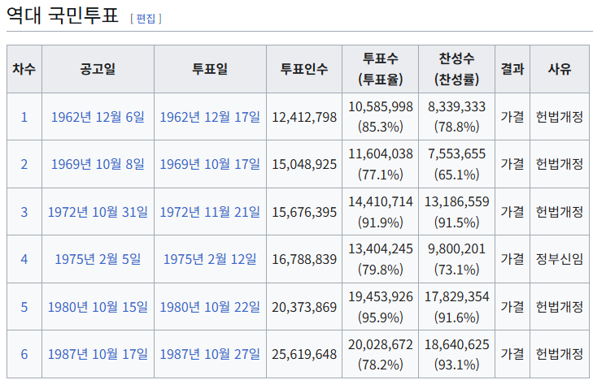

## 헌법 재단의 역사와 그로부터 배우는 미래 헌법의 모습을 상상하다
### 제헌 헌법(48년)
- 헌법에 담을 민주공화국의 모습과 국가의 모습을 치열하게 논의하다
- 이승만의 의지에 따라 대통령제를 채택

### [1차] 발췌 개헌(52년)
- 대통령 직선제, 양원제
- 50년 국회의원 선거에서 여당의 과반의석 확보에 실패하자, 이승만의 강압에 의해 국회의원이 뽑았던 대통령 선거를 국민 직선제로 개헌
- 정부와 국회가 제시한 개헌안을 각각 발췌하여 혼합한 타협안
- 국회의원들은 연행 감금되었고 투항, 기립표결을 강요당하여 166명 중 163명 찬성으로 가결
- 의회의 국정조사권 등 의원내각제적 요소가 반영됨

### [2차] 사사오입 개헌(54년)
- 대통령 중임제로의 개헌 및 초대 대통령은 중임 제한 예외를 두어 이승만의 영구 독재의 근거를 넣음
- 의원 내각제 요소를 제거함
- 재적의원 203명의 3분의 2는 135.33명 으로 136명이나, 사사오입 논리로 135 득표만으로 가결 처리함

### [3차] 제 2 공화국(60년)
- 60년 4.19 혁명으로 이승만 하야한 후, 의원 내각제로의 개헌
- 국민 기본권 보장 강화, 대법원장 및 대법관 선거제, 선거연령 20세 하향

### 부칙 개헌(60년)
- 3.15 부정선거 관련자 등 공민권 제한(?)과 부정축재자의 처벌에 관한 소급입법의 근거 마련

### [4차] 제 3 공화국(62년)
- 61년 5.16 쿠데타로 정권을 잡은 박정희에 의해 대통령제로의 회귀 및 대통령의 권한을 강화한 개헌
- 헌법전문 수정, 단원제 국회, 인간의 존엄과 가치조항 신설
- 국민투표(1차) 투표율 85.28%, 찬성 78.78%로 개정

### [5차] 3선 개헌(69년)
- 대통령의 계속 재임은 3기에 한함
- 대통령의 탄핵 소추 기준 상향
- 국민투표(2차) 투표율 77.1%, 찬성 65.1% 으로 개정

### [6차] 제 4 공화국 - 유신 개헌(72년)
- 대통령의 선출을 간접선거로 하고, 비상 조치권을 대폭 부여하여, 종신 집권의 근거 마련을 위한 개헌
- 10월 유신으로 불리는 셀프쿠데타 감행
- 국회 해산(근거없음), 헌법 일부 조항 효력 정지, 비상국무회의 구성(근거없음)에서 헌법 개정안 의결 및 공고, 긴급조치 시행으로 인권 유린 합법적 자행
- 72년 11월 국민투표(3차) 투표율 91.9%, 찬성 91.5%
- 통일주체 국민회의에서 대통령 뽑음(72년, 78년)
- 75년 유신헌법 찬반 및 대통령 신임 국민투표(4차) 투표율 80%, 찬성 73%

### [7차] 제 5 공화국 - 국보위 개헌(80년)
- 79년 10.26 사태로 대통령 서거 후, 12.12 사태로 정권을 잡은 전두환에 의해 7년 단임제 대통령으로의 개헌
- 행복추구권, 환경권, 적정임금조항 신설
- 80년 10월, 국민투표(5차) 투표율 95.9%, 찬성 91.6%로 개정

### [8차] 제 6 공화국 - 직선제 개헌(87년)
- 87년 6월 항쟁과 6.29 선언으로, 대통령 직선제로 바뀜
- 국회 권한 강화
- 국민 기본권 신장
- 국정 감사 부활
- 국회 해산권 삭제
- 국회 비상계엄 해제권 부여
- 국군의 중립 의무
- 87년 국민투표(6차) 투표율 78.2%, 찬성 93.1%로 개정

## 기억에 남는 부분
### 헌법은 율령이 아니다
- 헌법은 국민의 기본권을 보장하고, 국가 공동체 전체의 권리를 신장시키는 방향이 되어야 한다.
- 황제라는 절대 권력자가 통치하기 위해 각종 형벌과 굴종의 예법을 정해 놓은 것이 아님

### 서양의 시민혁명은 보통 선거권을 둘러싼 투쟁
- 재산, 성별, 지역에 상관없이 성인 모두에게 투표권을 부여하는 것은 엄청난 진통을 겪으며 정착된 제도임

### 유신 시대
- 정부가 주도한 경제성장의 냉혹한 현실은 규제와 조정, 제한과 의무를 강조한 헌법의 경제조항과 참으로 맞닿아 있음

## 느낀점
- 헌법에는 국민의 기본권 등 권리 보장이 명문화 되어 있으며, 국민의 생활을 조화롭게 하고 국가 운영과 나아가야 할 방향을 제시하는 최상위 법
- 권력자의 입맛에 맞게 수차례 개정되면서, 장기독재의 근거가 헌법에 반영되고 권력 유지의 수단으로 사용됨
- 개헌의 역사를 보니, 권력의 정점에 있어본 사람들은 계속 유지하고 싶은 게 인간 본성인 듯 싶음
- 국민투표에 부쳤을 때, 많은 찬성이 나왔다는 점이 놀라웠는데, 이는 혼란하고 넉넉치 않았던 당시에 강력한 통치자가 나라를 잘 이끌어 주었으면 하는 바램이었을 듯 함
- 국민과 국가의 기본 질서와 운영 방향을 정한 커다란 틀이자 약속이기 때문에, 헌법이 지켜지지 않으면 큰 혼란이 올 것이므로, 이를 지키는 게 중요함
- 미래의 헌법은 권력자가 자기 맘대로 바꾸지 않고, 국민 생활의 향상과 국가 발전이라는 방향에 맞게 발전시켜 나갔으면 함

> 추가 자료  
> - 기록으로 보는 헌법 개정사 - 국회기록보존소  
> - 대한민국의 국민투표 - 위키백과

